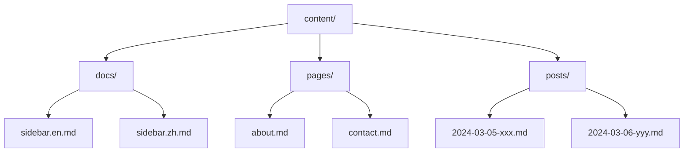
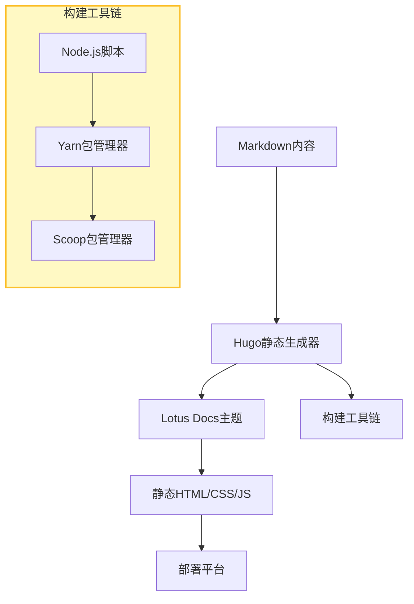
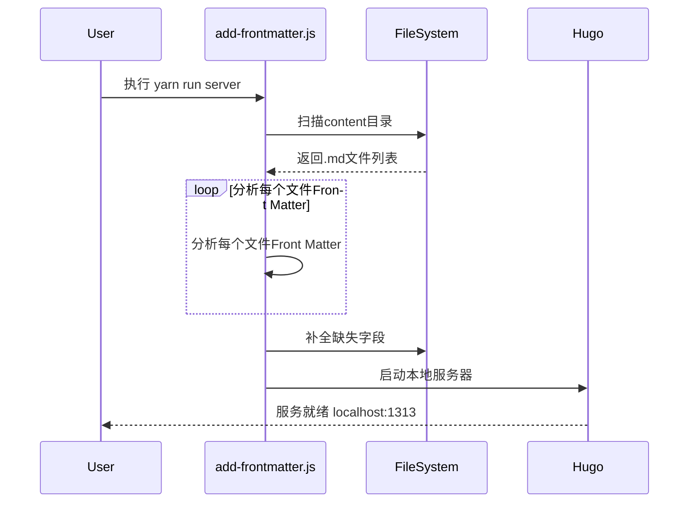

```mermaid
%% 用Mermaid复刻你图片中的目录结构
graph TD
    A[content/] --> B[docs/]
    A --> C[pages/]
    A --> D[posts/]
    B --> B1[sidebar.en.md]
    B --> B2[sidebar.zh.md]
    C --> C1[about.md]
    C --> C2[contact.md]
    D --> D1[2024-03-05-xxx.md]
    D --> D2[2024-03-06-yyy.md]
```

``` mermaid
graph TD
    A[Markdown内容] --> B[Hugo静态生成器]
    B --> C[Lotus Docs主题]
    B --> D[构建工具链]
    
    subgraph 构建工具链
        direction TB
        E[Node.js脚本] --> F[Yarn包管理器]
        F --> G[Scoop包管理器]
    end
    
    C --> H[静态HTML/CSS/JS]
    H --> I[部署平台]
    
    classDef subgraphStyle fill:#fff9c4,stroke:#fbc02d,stroke-width:2px
    class 构建工具链 subgraphStyle
```

```mermaid
sequenceDiagram
    participant User
    participant Script as add-frontmatter.js
    participant FS as FileSystem
    participant Hugo

    User->>Script: 执行 yarn run server
    Script->>FS: 扫描content目录
    FS-->>Script: 返回.md文件列表
    loop 分析每个文件Front Matter
        Script->>Script: 分析每个文件Front Matter
    end
    Script->>FS: 补全缺失字段
    Script->>Hugo: 启动本地服务器
    Hugo-->>User: 服务就绪 localhost:1313
```